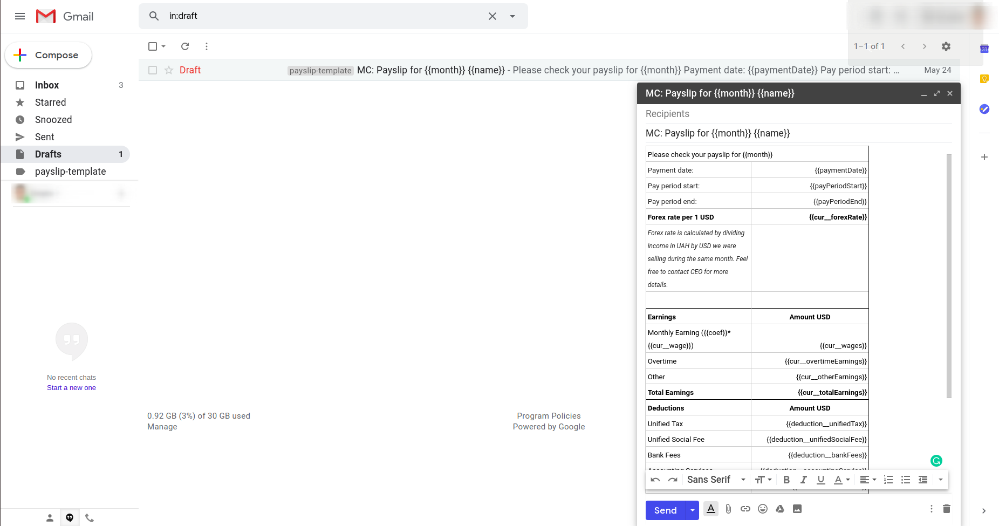
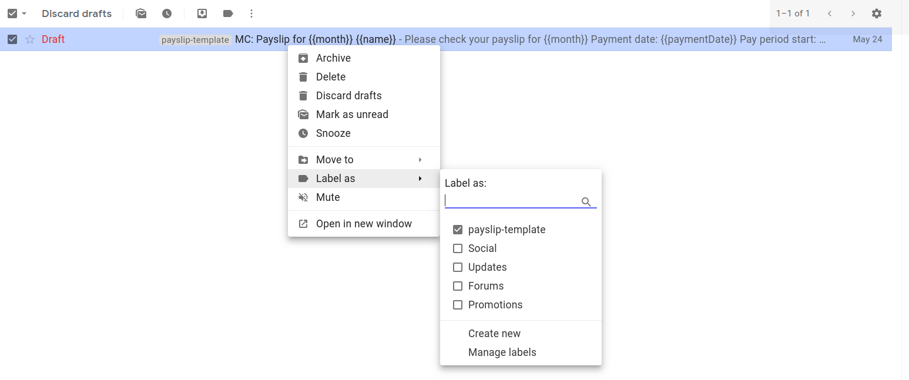

# Payslip
## Introduction
Payslip is [Container-bound Script](https://developers.google.com/apps-script/guides/bound), for google sheet. It can help you send payslips only by one button click! Enjoy 😉

## Installing
1. To create a bound script, open a Google Sheets file, then select Tools > Script editor. To reopen the script in the future, do the same thing. Because bound scripts do not appear in Google Drive, that menu is the only way to find or open the script.
2. Set some name for your project (a top left corner).
3. Copy all files from <b>src</b> folder to your project. You can manually create scripts files in the project and copy-paste files names and files contents. Or use [clasp](https://github.com/google/clasp) for this purpose.
4. Remove initially created <b>.gs</b> file from the project.
5. Close script editor tab and reload sheet page. After these manipulations you will see new menu item - <b>Payslip Manager</b>.
You on the right way 🤘

## Setting up
1. Open Payslip > Settings. In field <b>Duplicate message to</b> insert appropriate email.
2. Push the button <b>Save settings</b>.
3. In local project folder, go to <b>assets</b>. Import file <b>Payslip Template.docx</b> in to your Google docs.
4. Open your Gmail and create empty email draft.
5. Copy all content of the file in Google docs into this email draft.
6. Add some subject to the your draft. Example: `MC: Payslip for {{month}} {{name}}`.

7. Add label <b>payslip-template</b> to this draft.

8. Close the draft email.

## Done 🏆
